# a) Componentes y funcionamiento de los servicios del servidor

### Contenedor Docker:
Es el entorno aislado que ejecuta WildFly. Usa network namespaces para aislar su red del host y crea un puente virtual (docker0) que conecta el contenedor con la máquina host. Los puertos 8080 y 9990 están mapeados mediante NAT para permitir acceso externo.

### Wildfly Application Server:

Es el servidor de aplicaciones Jakarta EE que actúa como contenedor para tu aplicación. Internamente tiene:
- **Undertow**: El servidor web HTTP que escucha en el puerto 8080 y gestiona las peticiones entrantes.
- **Subsistemas**: CDI (inyección de dependencias), Jakarta REST (JAX-RS), JPA, transacciones, datasources, etc.
- **Deployment Scanner**: Monitoriza y despliega automáticamente los WAR.

### Archivo WAR:

Es el artefacto desplegable que contiene:
- Clases compiladas: la definición de la ruta base para REST, y el recurso que expone el CRUD. `Task.java` es el modelo de datos. El resto son archivos para que las tareas funcionen.
- Descriptores: `jboss-web.xml` define el contexto para personalizar la URL base, sin tener que modificar como se llama el archivo `.war`.
- Dependencias: Jakarta EE 10 API con Wildfly.

### Puertos:

**8080**: Puerto desde el que se escuchan las peticiones de la aplicación. Es el punto de entrada mapeado con Docker.

**9990**: Puerto donde se expone la consola de administración. Me permite configurar todo, monitorizar métricas y gestionar despliegues. También me permite modificar `standalone.xml` con advertencias por si hago algo mal.

### Endpoint REST (/api/tasks):

Es el rescurso Java de `TaskResource.java` cuyo `@Path("/tasks")` es el punto de partida. Todo se mapea a partir de aquí:
- `GET /api/tasks`: devuelve un JSON con todas las tareas.
- `GET /api/tasks/{id}`: devuelve la tarea con ese id o 404.
- `POST /api/tasks`: crea una nueva tarea. Necesario el titulo.
- `PUT /api/tasks/{id}`: actualiza una tarea existente.
- `DELETE /api/tasks/{id}`: elimina tarea por ID.

Las anotaciones que hay en el código indican que se trabaja con JSON.

---

## Flujo de usuario:

1. Cliente inicia la petición
2. Se procesa la petición y se manda al puerto 8080
3. Docker Desktop intercepta el tráfico, creando una red virtual. Wildfly tiene una IP asignada y se redirigen a ese contenedor.
4. Undertow recibe la conexión y parsea la petición HTTP.
5. Wildly busca el routing correcto por el contexto y la delega.
6. Jakarta REST analiza la ruta y procesa según la configuración.
7. Se crea una instancia de `TaskResource` si todo ha ido bien.
8. Se ejecuta la lógica de negocio, añadiendo la tarea a la lista (en caso de que sea añadir una por ejemplo).
9. Serialización de la respuesta: la `List<Task>` a JSON.
10. Construccion de la respuesta HTTP.
11. Docker Desktop reenvia la respuesta de forma inversa.
12. Cliente recibe y procesa mostrando el JSON.

---

## Evidencias parte a):

Contenedores y puertos publicados del contenedor Wildfly:

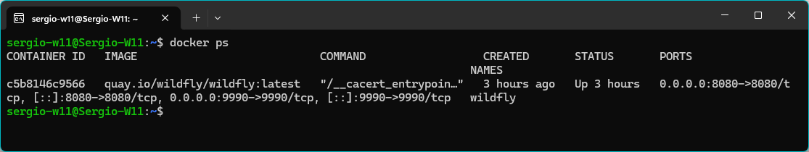

Despliegue y acceso del contenedor (sus logs):

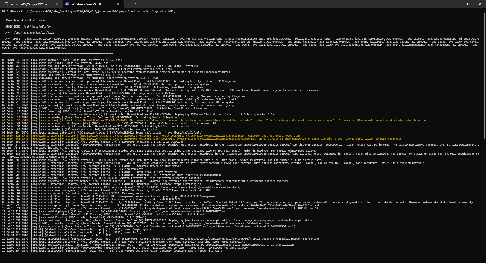

Respuesta del endpoit (previamente poblado porque esta vacio):

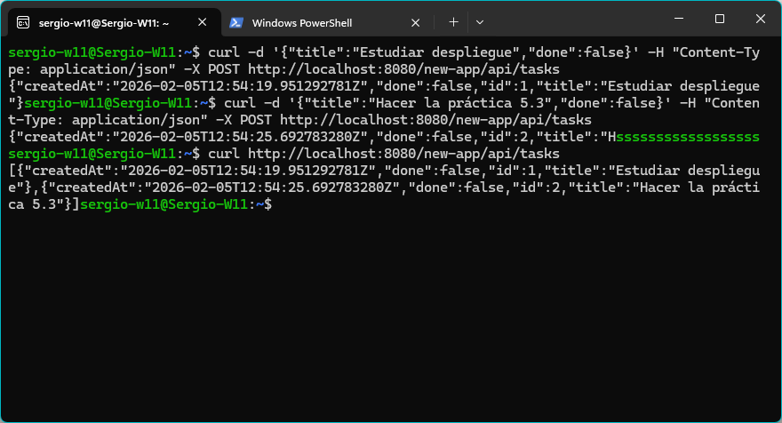

---

# b) Archivos principales de configuración y bibliotecas compartidas

La ruta del archivo de configuración:

```bash
docker exec -it wildfly ls -lh /opt/jboss/wildfly/standalone/configuration/
```

El comando me muestra:

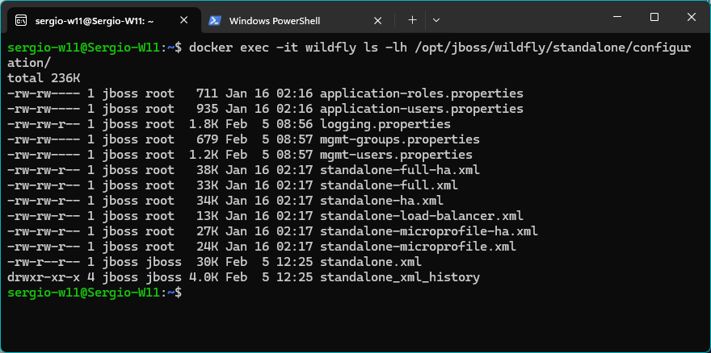

Se podría tocar la configuración de **Datasources** que es donde configuro mi conexión a una base de datos, por ejemplo MySQL, para guardar las tareas en una base de datos en lugar de un JSON gigante.

También para cambiar los puertos e interfaces red para utilizar otros puertos y ajustar la ruta donde se guardan los logs.

---

La práctica pide que use ``build.gradle.kts`` de la práctica 5.2, pero en el repositorio del 5.3 no hay y hay un ``build.gradle`` que está teniendo prioridad sobre el ``.kts``. He recuperado y modificado el ``.kts`` y renombrado a ``old`` el otro para que se use el que pide la práctica.

```bash
dependencies {
    compileOnly("jakarta.platform:jakarta.jakartaee-api:10.0.0")

    testImplementation("org.junit.jupiter:junit-jupiter:5.10.2")
}
```

Evidencia:

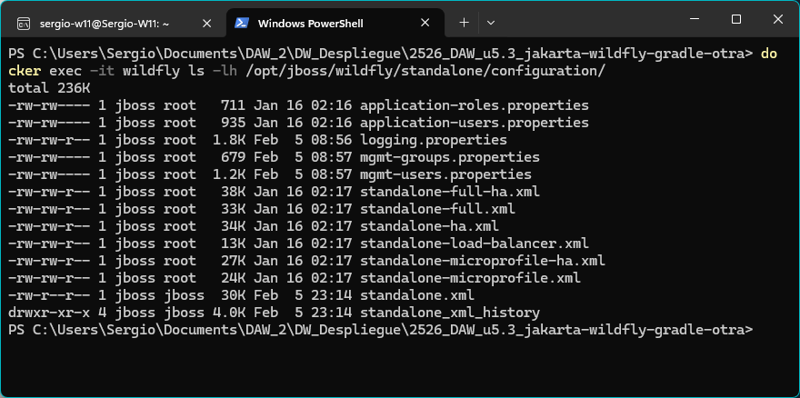

# c) Cooperación con el servidor web (proxy / reverse proxy) y https

La arquitectura que propongo es:

Internet (a través del puerto 443 HTTPS) -> Nginx (mi contenedor alpine) -> Wildfly (puerto interno 8080, que no está expuesto).

Entonces en el entorno real de trabajo, lo que quedaría sería nginx que sería mi proxy reverso para recibir las peticiones de forma segura.

Esto cumple con el objetivo de publicar la API con rutas claras, sin exponer el puerto 9990 y cifrar el tráfico con HTTPS de forma externa, pero mantiene HTTP internamente entre los dos contenedores.

Como quedaría el nginx:

```nginx:

events {
    worker_connections 1024;
}

http {

    server {
        listen 80;
        server_name ejemplo.local;
        return 301 https://$server_name$request_uri;
    }

    server {
        listen 443 ssl http2;
        server_name ejemplo.local;

        ssl_certificate     /etc/nginx/ssl/server.crt;
        ssl_certificate_key /etc/nginx/ssl/server.key;
        ssl_protocols       TLSv1.2 TLSv1.3;

        # URL interna real: http://wildfly:8080/new-app/api/...
        # URL pública expuesta: https://ejemplo.local/api/...
        location /api/ {
            proxy_pass http://wildfly:8080/new-app/api/;
            proxy_set_header Host              $host;
            proxy_set_header X-Real-IP         $remote_addr;
            proxy_set_header X-Forwarded-For   $proxy_add_x_forwarded_for;
            proxy_set_header X-Forwarded-Proto https;
        }

        location /console {
            return 403;
        }
    }
}
```

En esta configuración, Nginx escucha en los puertos 80 y 443, pero solo WildFly escucha en el 8080 de forma interna.

Que cambia entre la 5.2 y la 5.3 a este nuevo despliegue:

Actualmente:
- Se accede directamente a WildFly.
- El puerto 8080 está expuesto al host y si se mapea, puede acabar estando publicamente.
- El puerto 9990 también se encuentra expuesto si se publica mapeandolo.

Con la configuración de proxy:
- Los clientes externos solo ven a Nginx.
- El puerto 8080 de WildFly queda oculto en una red interna entre Nginx y WildFly.
- El puerto 9990 no se expone en Nginx, lo que hace que solo sea accesible desde red privada o máquina del adminsitrador.
- Las rutas son más limpias.

Y para la configuración de TLS y ventajas:

```bash
ssl_certificate     /etc/nginx/ssl/server.crt;
ssl_certificate_key /etc/nginx/ssl/server.key;
ssl_protocols       TLSv1.2 TLSv1.3;
```

Este fragmento activa el HTTPS en el frontal, usando un certificado SSL/TLS.

Las ventajas:
1. Cifrado de datos de tránsito: todo el tráfico va cifrado.
2. Autenticación del servidor: el navegador puede verificar que se está conectando al servidor.
3. Integridad de los datos: se asegura que en el tránsito los datos no se modifican.
4. Mejora experiencia y SEO: los navegadores marcan el lugar como "seguro".
5. Cumplimiento normativo: La legalidad lo pide.

¿Cambia algo en mi app?

No en mi app en si no, en WildFly, habría que cambiar en Undertow una aseguración de que el cliente original vino por HTTPS habilitando que haya cabeceras de forma correctas.

---

# d) Mecanismos de seguridad del servidor de aplicaciones

Lo que aplique en la 5.2:

1. Acceso a la consola de administración 9990 con usuario y contraseña.
2. Exposición de puertos limitada al entorno local exponiendo los puertos sólo en mi máquina local.
3. Gestión de secretos mínima, sin añadirlas en código fuente.
4. Logs activados por defecto, los cuales me han permitido ver el despliegue de WAR, los accesos a endpoints y mensajes de mi `TaskResource`.

## Medidas adicionales para un entorno de producción:

1. Consola de administración y sus credenciales.

Medida 1:
- En lugar de `-p 9990:9990`, directamente no publico ese puerto en Docker.
- El acceso solo es desde VPN o red interna.

Al no exponerla, evito ataques de fuerza bruta.

Medida 2:
- Los usuarios administrativos deben tener contraseñas únicas y robustas.
- Aplicar control de acceso basado en roles para que no todos los administradores tengan los mismos permisos.

Esto permite que si una cuenta falla, no haga un daño gigante.

2. Exposición de puertos:

Medida 3:
- Colocar nginx (que ahora mismo no hay) frente a WildFly para exponer los puertos que yo quiera.

3. Gestión de secretos:

Medida 4:
- Usar variables de entorno o mecanismos de secretos en lugar de usuarios/contraseñas en DockerFiles y tal.

Medida 5:
- Separar los usuarios de administración de los de aplicación, usando los que ya tiene WildFly por defecto, pero volviendo a la parte 2, separarlos por roles incluso dentro de los de administración.

4. Registro y trazabilidad.

Medida 6:
- Configurar el subsistema de loggin para enviar logs a un fichero dedicado, separar logs de aplicación de los de servidor y logs de acceso HTTP en UnderTow.

Estas serían algunas de las medidas de seguridad que llevaría a cabo para que mi entorno de producción fuese totalmente seguro.

Evidencias de la configuración actual.

Puertos expuestos:


Consola de administración 9990:
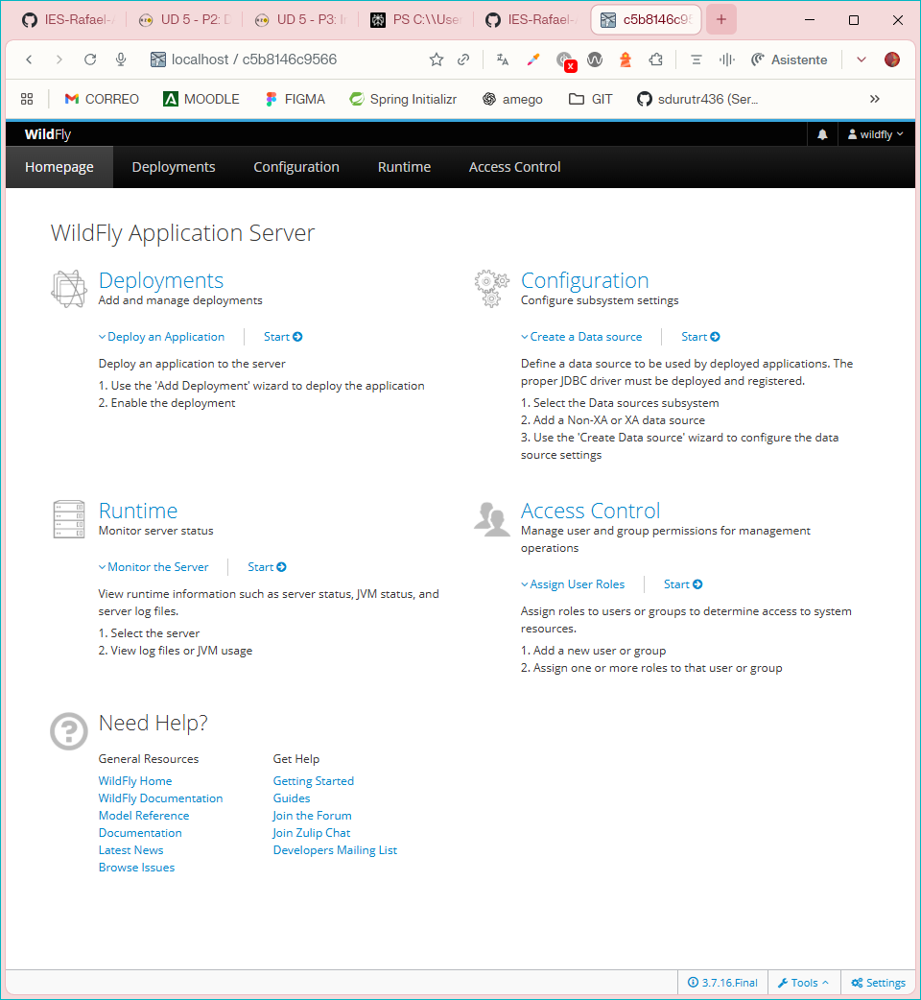

Política actual de secretos:
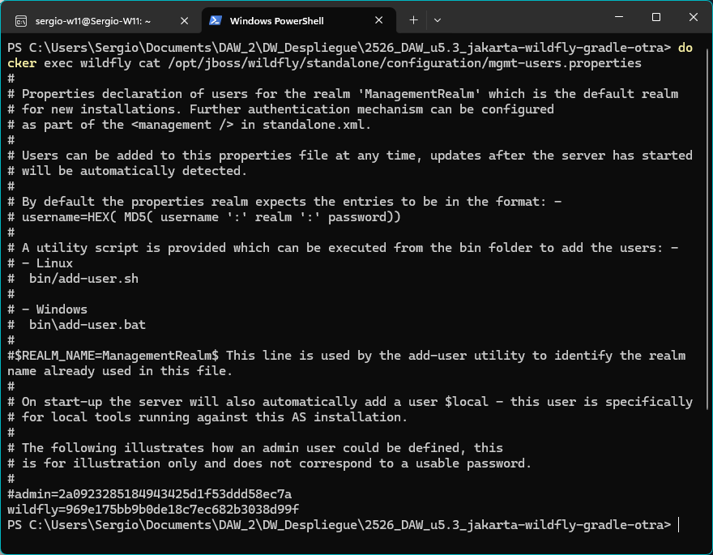

En producción, las credenciales de base de datos y otros secretos se inyectarían como variables de entorno o mediante un sistema de secretos (no en el código fuente ni en el repositorio), aunque ahora mismo los hashes de contraseña se guardan en el contenedor directamente.

---

# e) Componentes web del servidor de aplicaciones

## Qué es el WAR y que contiene:

La aplicación REST se empaqueta en un WAR, es un zip especial que conteine todo lo necesario para desplegar una aplicación web Jakarta EE: clases java, recursos estáticos...

En la 5.3 lo que tiene son clases con rutas para peiticiones de API, y los modelos y su persistencia, además de un WEB-INF, que gracias a jboss, enmascaro la ruta con un nombre presentable en lugr de directamente el nombre del `.war`.

Todo esto forma parte de la aplicación que WildFly despliega.

## Qué significa el contexto / ruta base de la app.

Cuando se despliega el WAR, se le asigna un **context root** de despliegue. Esto se define gracias al ``jboss-web.xml``.

Esto significa que todo lo que hay dentro de ese WAR se sirve bajo la URL base. A partir de ahí se le añaden las rutas definidas en las @ApplicationPath y @Path de Java.

## Qué parte del servidor sirve la API:

En WildFly, el componente que se encarga de recibir y servir las peticiones es el subsistema Undertow, que actua como contenedor web.

Undertow escucha en el puerto 8080 (HTTP) y 8443 (HTTPS interno). Cuando llega una petición HTTP:

- Mira la URL.
- Decide qué contexto (/new-app, /myproject/module/backend, etc.) debe manejarla.
- Dentro de ese contexto, delega a la implementación de Jakarta REST (RESTEasy) para mapear la URL a tus recursos.

## Desglose de URL real:

``http://localhost:8080/new-app/api/tasks``

- http → Protocolo (sin cifrado en este despliegue de prácticas).
- localhost → Host (tu propia máquina).
- 8080 → Puerto donde Undertow (WildFly) escucha peticiones HTTP.
- /new-app → Context root del WAR crud-file-1.0.0.war, definido en jboss-web.xml.
- /api → Ruta base REST, definida por @ApplicationPath("/api") en TasksApplication.
- /tasks → Recurso REST concreto, definido por @Path("/tasks") en TaskResource.

Evidencias:

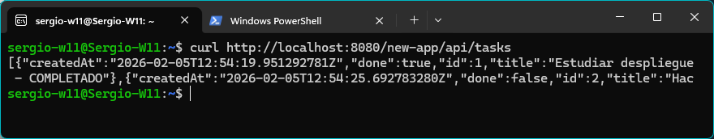

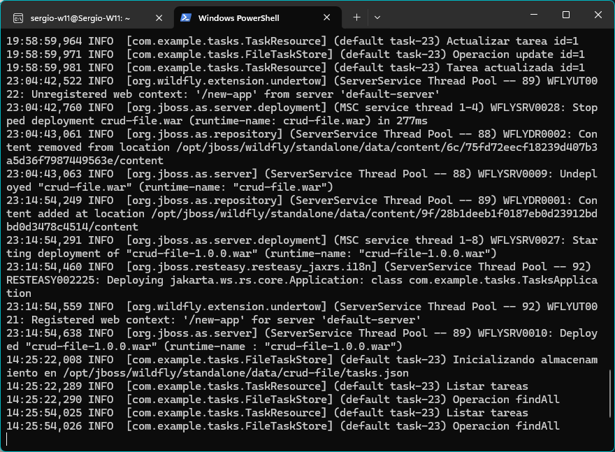

---

# f) Parámetros necesarios para el despliegue

Los parámetros que he usado para el despliegue:

1. Nombre:

```bash
docker run -d --name wildfly ...
```

Al añadir el ``--name wildfly`` puedo referirme en cualquier otro comando llamarlo con ese nombre en lugar de un hash.

Si estuviera mal, la llamada fallaría.

2. Mapeo de puertos en Docker:

```bash
docker run -d --name wildfly -p 8080:8080 -p 9990:9990 ...
```

Estos mapeos de puertos me permite acceder a las aplicaciones desplegadas desde el host de Windows (8080) y acceder a la consola de administración de Wildfly (9990).

Si el mapeo estuviese equivocado, el contenedor funciona pero no se puede acceder a la API ni a la consola.

3. Arranque de WildFly:

```bash
/opt/jboss/wildfly/bin/standalone.sh -b 0.0.0.0 -bmanagement 0.0.0.0
```

Hace que el servidor HTTP escuche en todas las interfaces del contenedor. Esto es imprescindible para que Docker pueda enrutar el tráfico, además de permitir que se pueda acceder en entorno local a la consola de administración.

Hacerlo mal, provocaria un fallo similar al del punto anterior, no podría accederse ni a la API ni a la consola.

4. Nombre del WAR y ruta de despliegue.

```bash
docker cp build/libs/crud-file-1.0.0.war \
  wildfly:/opt/jboss/wildfly/standalone/deployments/
```

La ruta es el directorio que WildFly monitoriza con el deployment scanner. Cualquier `.war` que se copie ahi se despliega. El archivo debe de coincidir con el que se genera por Gradle.

Si estuviese mal esa coincidencia, falla con que no se puede encontrar el archivo en la ruta especificada. No se despliega nada y si fuese en otra ruta, mas de lo mismo.

5. Conxter root configurado en `jboss-web.xml`

```xml
<jboss-web>
    <context-root>/new-app</context-root>
</jboss-web>
```

Define la ruta base bajo la que WildFly despliega la app. Permite tener varias sin colisión de nombre. Si no se define, el contexto es el nombre del WAR.

Si estuviese mal, darían errores 404 y si tuviesen el mismo contexto, se liaria y daría error también.

6. Ajustes de build en Gradle.

```kotlin:
plugins {
    java
    war
}

group = "com.example"
version = "1.0.0"

dependencies {
    // Jakarta EE 10 API (provided por WildFly)
    compileOnly("jakarta.platform:jakarta.jakartaee-api:10.0.0")
}

tasks.withType<War> {
    archiveBaseName.set("crud-file")
}
```

Indicar a Gradle que tiene que generar un WAR es el formato que Wildfly sabe desplegar.

Si estuviese mal, se generará un JAR que no sabe desplegar.

---

# g) Pruebas de funcionamiento y rendimiento

En mi entorno he realizado pruebas funcionales básicas sobre los endpoints REST, utilizando curl para comprobar que las operaciones CRUD funcionan correctamente.

```bash
curl http://localhost:8080/new-app/api/tasks
```

```bash
curl -d '{"title":"Estudiar despliegue","done":false}' \
     -H "Content-Type: application/json" \
     -X POST http://localhost:8080/new-app/api/tasks
```

```bash
curl -d '{"title":"Estudiar despliegue - COMPLETADO","done":true}' \
     -H "Content-Type: application/json" \
     -X PUT http://localhost:8080/new-app/api/tasks/1
```

```bash
curl -X DELETE http://localhost:8080/new-app/api/tasks/2
```

Resultado:


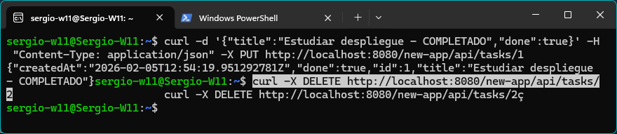

---

Prueba de rendimiento con hey:

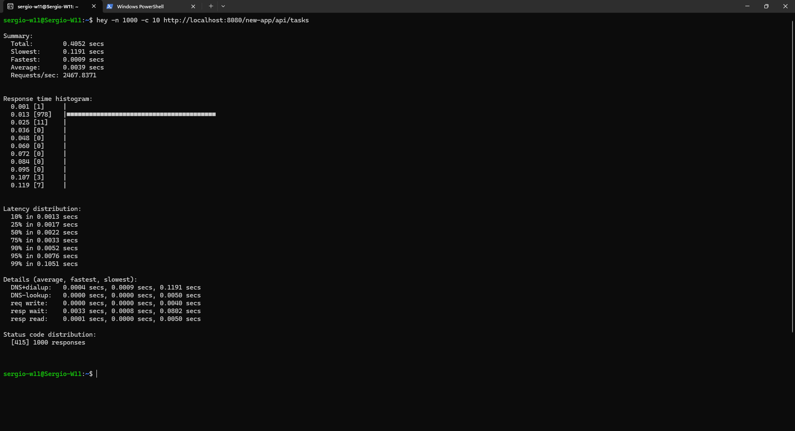

---

# h) Documentación de administración y recomendaciones

Esta guía documenta el proceso completo de administración del despliegue Docker Compose para la aplicación REST con WildFly y Nginx. Está diseñada para que cualquier miembro del equipo pueda reproducir el entorno sin conocimientos previos.

El sistema ahora se compone de dos contenedores orquestados mediante Docker Compose:

Internet (HTTPS:443)
        ↓
   [Nginx Alpine]
        ↓
Red interna (backend)
        ↓
   [WildFly 39]
        ↓
Application WAR (crud-file-1.0.0.war)

**Características clave:**

- WildFly no está expuesto directamente al host.
- Nginx actúa como proxy reverso y termina las conexiones SSL/TLS.
- Comunicación interna entre contenedores en red privada.
- Volúmenes para persistencia de logs.
- Reinicio automático de servicios.

## Docker compose:

```bash:
version: '3.8'

services:
  wildfly:
    image: quay.io/wildfly/wildfly:latest
    container_name: wildfly
    command: /opt/jboss/wildfly/bin/standalone.sh -b 0.0.0.0 -bmanagement 0.0.0.0
    networks:
      - backend
    volumes:
      - ./deployments:/opt/jboss/wildfly/standalone/deployments
    restart: unless-stopped

  nginx:
    image: nginx:alpine
    container_name: nginx
    depends_on:
      - wildfly
    networks:
      - backend
    ports:
      - "80:80"
      - "443:443"
    volumes:
      - ./nginx/nginx.conf:/etc/nginx/nginx.conf:ro
      - ./nginx/ssl:/etc/nginx/ssl:ro
      - nginx-logs:/var/log/nginx
    restart: unless-stopped

networks:
  backend:
    driver: bridge

volumes:
  nginx-logs:
```

## Configuración nginx:

```bash:
events {
    worker_connections 1024;
}

http {
    # Redirigir HTTP a HTTPS
    server {
        listen 80;
        server_name localhost;
        return 301 https://$server_name$request_uri;
    }

    # Servidor HTTPS frontal
    server {
        listen 443 ssl http2;
        server_name localhost;

        ssl_certificate     /etc/nginx/ssl/server.crt;
        ssl_certificate_key /etc/nginx/ssl/server.key;
        ssl_protocols       TLSv1.2 TLSv1.3;

        access_log /var/log/nginx/access.log;
        error_log  /var/log/nginx/error.log;

        # Proxy a la aplicación JBoss/WildFly con context-root /new-app
        location /api/ {
            proxy_pass http://wildfly:8080/new-app/api/;
            proxy_set_header Host              $host;
            proxy_set_header X-Real-IP         $remote_addr;
            proxy_set_header X-Forwarded-For   $proxy_add_x_forwarded_for;
            proxy_set_header X-Forwarded-Proto https;
        }

        # Bloquear consola de administración
        location /console {
            return 403;
        }
    }
}
```

## Como levantarlo todo:

Desde el directorio ``compose-deploy``:

```bash:
docker compose up -d
```

```bash:
docker compose ps
```

Para comprobar que ambos contenedores corren. Para comprobar que se desplego correctamente:

```bash
docker logs wildfly | Select-String "Registered web context"
```

Debe de dar: ``Registered web context: '/new-app' for server 'default-server'`` 

## Desplegar nueva versión del WAR:

Desde la raiz se compila un nuevo WAR:

```powershell
.\gradlew clean build
```

Se tiene que verificar (fue uno de mis fallos) que jboss está incluido:

```powershell
jar -tf build\libs\crud-file-1.0.0.war | Select-String "jboss-web.xml"
```

Se para el contenedor de WildFly que haya corriendo:

```powershell
cd compose-deploy
docker compose stop wildfly
```

Y reemplazamos el WAR:

```powershell
Copy-Item ..\build\libs\crud-file-1.0.0.war deployments\ -Force
```

Relevantamos el contenedor WildFly:

```powershell
docker compose start wildfly
```

Y verificamos que se haya levantado con el nombre que pusimos en jboss.

## Comprobar el estado del sistema:

```powershell
docker compose ps
docker logs wildfly
docker logs wildfly -f
docker logs nginx
docker exec nginx cat /var/log/nginx/access.log
docker exec nginx cat /var/log/nginx/error.log
```

Estos comandos permiten, verificar los contenedores, seguir los logs, logs en tiempo real, logs de nginx, logs permanentes de nginx.

## Pruebas de funcionamiento:

En WSL los he tirado:

```bash
curl https://localhost/api/tasks -k
```

Devuelve un json con todas las tareas. Vacio si no hay.

```bash
curl https://localhost/api/tasks -k -X POST \
  -H "Content-Type: application/json" \
  -d '{"title":"Tarea de prueba","done":false}'
```

Creo una tarea.

```bash
curl https://localhost/api/tasks/1 -k -X PUT \
  -H "Content-Type: application/json" \
  -d '{"title":"Tarea actualizada","done":true}'
```

Actualizo una tarea.

```bash
curl https://localhost/api/tasks/2 -k -X DELETE
```

Elimino una tarea.

## Parar y eliminar el entorno

```powershell
docker compose stop
docker compose down
docker compose down -v
```

Con eso paro, elimino el contenedor pero manteniendo los volúmenes y con -v elimino los contenedores.

## URL de acceso de mi aplicación:

``https://localhost/api/tasks`` API Rest, el endpoint principal.

``http://localhost`` redigire directamente a HTTPS, por nginx.

``http://wildfly:8080`` accesible desde red interna a Wildfly.

> La URL http://localhost:8080 ya NO funciona porque WildFly no está expuesto directamente al host.

## Errores:

Error 1: El WAR se despliega con context-root incorrecto

``Registered web context: '/crud-file-1.0.0' for server 'default-server'``

El archivo jboss-web.xml no está dentro del WAR o tiene una ruta incorrecta.

Solución:

1. Verificar que existe src/main/webapp/WEB-INF/jboss-web.xml
2. Recompilar completamente: .\gradlew clean build
3. Verificar inclusión: jar -tf build\libs\crud-file-1.0.0.war | Select-String "jboss-web.xml"
4. Redesplegar siguiendo el procedimiento completo

Error 2: 404 Not Found al acceder a la API

```bash
curl https://localhost/api/tasks -k
<html><head><title>Error</title></head><body>404 - Not Found</body></html>
```

- WildFly no ha desplegado la aplicación todavía.
- El context-root en nginx.conf no coincide con el desplegado en WildFly.
- La aplicación falló al desplegarse.

Solución:

1. Verificar logs de WildFly: docker logs wildfly | Select-String "Registered web context"
2. Si muestra /crud-file-1.0.0 en lugar de /new-app, seguir el procedimiento del Error 1
3. Si no muestra ningún context-root, revisar logs completos buscando errores de despliegue

---

# i)  Virtualización, nube o contenedores en el despliegue

He desplegado una arquitectura multi-contenedor usando Docker Compose que incluye:

- Nginx como proxy reverse, con certificados SSL, que redirige las peticiones HTTP a HTTPS, exponiendo los puertos 80 y 443.
- Servidor de aplicaciones Wildfly que ejecutra Jakarta EE, no se expone directamente al host y solo se acceder por red interna.
- Aplicación RESTFUL.

Se adjuntan los archivos necesarios para que el Docker Compose al generar el contenedor funcione correctamente.

El despliegue permite realizar operaciones CRUD completas sobre la API REST a través de HTTPS, con Nginx como punto de entrada único y WildFly ejecutándose en una red privada sin exposición directa.